# Piano Integrato di Ricerca di Mercato per Startup

## 📱 Idea 1: Virtual Social Hub per Lavoro Ibrido
### 🎯 Obiettivi di Ricerca
1. Validare il "pain" da frammentazione degli strumenti (Slack/WhatsApp/Jira)
2. Testare appeal elementi di giocoficazione (reward, avatar, sfide)
3. Quantificare disponibilità pagamento per integrazioni API premium
4. Verificare interesse pacchetto gaming (Discord/Steam)

### 👥 Target Prioritario
| Segmento | Caratteristiche | Dimensione Campione |
|----------|----------------|---------------------|
| PMI ibride (10-100 dip) | Team misti ufficio/remote | 30+ sondaggi |
| Manager/Team Leader | Frustrati da 5+ tool | 5+ interviste |
| Comunità gaming | Team esports, gruppi Discord | 15+ test UX |

### 🔍 Metodologia di Ricerca
#### Ricerca Secondaria

```mermaid
graph LR
A[Analisi Competitor] --> B[Gather.town • Kumospace]
A --> C[Microsoft Mesh • Slack]
D[Report Mercato] --> E[Statista - Software Collaborativo]
D --> F[Gartner - Trend Lavoro Ibrido]
```

#### Ricerca Primaria
#### Sondaggi Quantitativi
1. "Quante app usi giornalmente? [1-3 | 4-6 | 7+]"
2. "Punteggia la frustrazione switch app (1=minima, 10=massima)"
3. "Quali elementi di giocoficazione preferisci?
    - Sfide a squadre
    - Sistemi reward
    - Avatar personalizzati
    - Nessuno"

#### Interviste Qualitative (5 manager + 5 gamer)
  - Esempio: "Descrivi un giorno tipico di coordinamento team ibrido"

#### Landing Page Test (Carrd/Unbounce)
  - Elementi da includere:
    - Mockup integrazione multi-app
    - Video 15s esperienza gamification (Loom)
    - Waitlist per accesso anticipato

#### Validazione Monetizzazione
Tier	Prezzo	Feature	Metodo Validazione
Free	€0	1 stanza, 10 utenti	Accettazione >70%
Base	€7/utente	Stanze illimitate	Van Westendorp test
Premium	€15/utente	API + gamification	Mockup + pricing survey

gantt
    title Timeline Ricerca - Virtual Hub
    dateFormat  DD-MM
    section Settimana 1
    Analisi competitor     : 01-01, 4d
    Design sondaggio       : 03-01, 3d
    section Settimana 2
    Raccolta dati          : 08-01, 5d
    Interviste             : 10-01, 3d
    section Settimana 3
    Test landing page      : 15-01, 4d
    Analisi risultati      : 18-01, 3d

### 🛒 Idea 2: App Gestione Inventari per Piccoli Negozi
#### 🎯 Obiettivi di Ricerca
##### Misurare tempo speso in gestione inventario
  1. Validare appeal funzionalità visibilità clienti
  2. Testare price sensitivity per tier premium
  3. Identificare integrazioni più richieste (tasse, ordini)

#### 👥 Target Prioritario
Segmento	Caratteristiche	Dimensione Campione
Negozi alimentari	<5 dipendenti, >100 prodotti	20+ osservazioni
Negozi abbigliamento	Gestione manuale	10+ test prototipo
Clienti finali	Acquirenti frequenti	50+ micro-sondaggi

🔍 Metodologia di Ricerca
Ricerca sul Campo

  - Interviste Osservative (3-5 negozi)
    - Focus su:
      - Processi inventario attuali
      - Errori frequenti (scorte, tasse)
      - Reazione a mockup app
  - Prototipo Low-Fi (Glide Apps)
    - Task: "Scansiona 10 prodotti fittizi"
    - Metrica: Tempo risparmiato vs metodo attuale (±30%)

### Ricerca Quantitativa
- Sondaggio Negozianti (Google Forms)

Domande critiche:
1. "Ore/settimana dedicate all'inventario? [<1 | 1-3 | 3-5 | 5+]"
2. "Problemi principali: 
    - Errori conteggio
    - Tempo eccessivo
    - Tasse imprecise
    - Perdite prodotto"
3. "Quanto è utile mostrare prodotti ai clienti? (1-10)"

### 💰 Modello Pricing & Validazione
Tier	Prezzo	Feature	Domanda Validazione
Free	€0	100 codici	"Accetta limite 100 prodotti?"
Base	€5/mese	Codici illimitati	"Pagherebbe per scansioni illimitate?"
Premium	€15/mese	Cloud + report	"Valore backup e analisi?"

gantt
    title Timeline Ricerca - App Inventari
    dateFormat  DD-MM
    section Settimana 1
    Reclutamento negozi   : 01-01, 3d
    Design prototipo      : 03-01, 2d
    section Settimana 2
    Interviste osservative : 08-01, 4d
    Sondaggio online      : 09-01, 3d
    section Settimana 3
    Test prototipo        : 15-01, 3d
    Analisi dati          : 17-01, 4d

### 🌳 Idea 3: Feature Marketplace (ex Skill Tree)
#### 🎯 Obiettivi di Ricerca
Validare dolore feature inutilizzate

Testare modelli monetizzazione (standalone vs integrato)

Misurare comprensione "albero delle feature"

Verificare interesse crowdfunding feature-specifico

👥 Target Prioritario
Segmento	Caratteristiche	Dimensione Campione
Founder startup	Pre-seed/seed stage	10+ interviste
Product Manager	Scale-up tech	5+ test mockup
Community builder	Indie hackers	20+ sondaggi

🔍 Metodologia di Ricerca
Test Concettuale

Mockup Interattivo Figma
Metriche:
Tempo comprensione <30 secondi
Tasso click "Finanzia questa feature" >25%

A/B Test Landing Page
graph LR
A[Traffico] --> B[Variante A: Standalone]
A --> C[Variante B: Integrata]
B --> D[CTA: Prova Demo]
C --> E[CTA: Calcola Risparmio]

Ricerca Qualitativa
Interviste Strategiche

Domande:
1. "Quale % feature sviluppate non è mai stata usata?"
2. "Finanzieresti feature se pagata anticipatamente dai clienti?"
3. "Ostacoli principali all'adozione?"

💰 Modelli Monetizzazione
Modello	Struttura	Metodo Validazione
Standalone	5-7% commissione	"Accetta fee per ridurre rischio?"
Integrato	€50/mese + 3% fee	"Valore dati di mercato reali?"
Crowdfunding	All-or-nothing	Test con Kickstarter

gantt
    title Timeline Ricerca - Feature Marketplace
    dateFormat  DD-MM
    section Settimana 1
    Ricerca forum        : 01-01, 2d
    Creazione mockup     : 03-01, 3d
    section Settimana 2
    Test con founder     : 08-01, 4d
    Analisi feedback     : 10-01, 3d

🔬 Strumenti & Risorse
Categoria	Strumenti	Costo	Link
Sondaggi	Google Forms, SurveyMonkey	Gratis - €30/mese	surveyplanet.com
Prototipi	Figma, Glide Apps	Gratis	figma.com
Landing Page	Carrd, Unbounce	€10-50/mese	carrd.co
Analisi Competitor	SimilarWeb, G2 Crowd	Gratis - €100/mese	similarweb.com
Reclutamento	LinkedIn Sales Nav, Facebook Gruppi	€50-200	linkedin.com/sales
User Testing	UserTesting, Maze	€30-100/test
